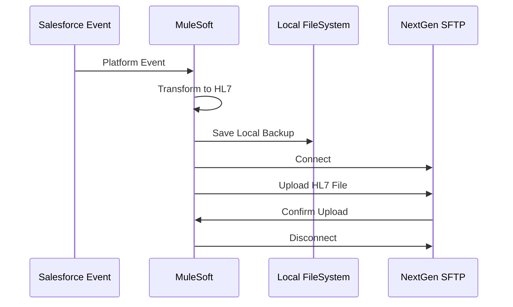

# SFTP Interface Specification

## Overview

The SFNextGen-v2 integration delivers HL7 messages to NextGen Office via secure SFTP file transfer. This interface ensures reliable message delivery with proper authentication and file management.

## Connection Configuration

### SFTP Server Details
- **Host**: `sftp.prod.ngo.nextgenaws.net`
- **Port**: 22 (default SFTP port)
- **Protocol**: SFTP (SSH File Transfer Protocol)
- **Authentication**: Username/Password
- **Working Directory**: `/`

### Connection Parameters
| Parameter | Value | Description |
|-----------|-------|-------------|
| Host | sftp.prod.ngo.nextgenaws.net | NextGen SFTP server |
| Username | foresthms | Client-specific username |
| Password | [Configured securely] | Encrypted password |
| Connection Timeout | 30000ms | Initial connection timeout |
| Response Timeout | 60000ms | Operation response timeout |
| Working Directory | / | Root directory for operations |

### Connection Pooling
- **Max Active Connections**: 5
- **Max Idle Connections**: 2
- **Initialization Policy**: INITIALISE_ONE
- **Exhausted Action**: WHEN_EXHAUSTED_WAIT
- **Max Wait Time**: 30000ms

## Directory Structure

### Upload Directories
```
/foresthms/
├── toNGO/
│   ├── ADT/          # ADT messages (A04, A08)
│   └── SIU/          # SIU messages (S12, S14, S15)
```

### Directory Purposes
- **ADT Directory**: Patient demographic messages (registration and updates)
- **SIU Directory**: Appointment scheduling messages (new, modify, cancel)

## File Naming Conventions

### ADT Files
- **Pattern**: `ADT{EventType}_{UUID}.hl7`
- **Examples**:
  - `ADT04_a1b2c3d4-e5f6-7890-abcd-ef1234567890.hl7`
  - `ADT08_b2c3d4e5-f6g7-8901-bcde-f23456789012.hl7`

### SIU Files
- **Pattern**: `SIU{EventType}_{UUID}.hl7`
- **Examples**:
  - `SIU12_c3d4e5f6-g7h8-9012-cdef-345678901234.hl7`
  - `SIU14_d4e5f6g7-h8i9-0123-defg-456789012345.hl7`
  - `SIU15_e5f6g7h8-i9j0-1234-efgh-567890123456.hl7`

### File Naming Rules
- **Event Type**: Two-digit code (04, 08, 12, 14, 15)
- **UUID**: Unique identifier for message tracking
- **Extension**: Always `.hl7`
- **Case**: Mixed case as shown

## File Content Format

### File Structure
- **Content**: Raw HL7 message text
- **Encoding**: UTF-8
- **Line Endings**: Carriage Return (\r) between segments
- **No Headers**: Pure HL7 content only

### Sample File Content
```
MSH|^~\&|NextGen Office^foresthms|FOREST HILLS MEDICAL SERVICES^1266378|FORESTHMS|FORESTHMS^1266378|20240115143022||ADT^A04|MSG123456|P|2.3
PID|1|123456|HF123456|HF123456|DOE^JOHN^MICHAEL||19850615|M||WHITE|123 MAIN ST^^ANYTOWN^NY^12345||5551234567^^^john.doe@email.com|||EN|SINGLE||||PATIENT DECLINED
PV1|1|O|FOREST HILLS^^^1275017^^^^^FOREST HILLS||||1275017^^^1275017^^^^^FOREST HILLS||||1275017^^^1275017^^^^^FOREST HILLS|||||||||||||||||||||||N|||||1266378;FOREST HILLS MEDICAL SERVICES;FORESTHMS
GT1|1|123456|DOE^JOHN^MICHAEL||123 MAIN ST^^ANYTOWN^NY^12345|(555)123-4567^^^john.doe@email.com||19850615000000|M||SELF|||||||||OTHER
```

## Upload Process

### Upload Workflow
1. **Message Generation**: HL7 message created from Salesforce event
2. **Local File Creation**: Message saved to local filesystem for backup
3. **SFTP Connection**: Establish secure connection to NextGen server
4. **File Upload**: Transfer HL7 file to appropriate directory
5. **Upload Verification**: Confirm successful transfer
6. **Connection Cleanup**: Close SFTP connection

### Upload Sequence


## Error Handling

### Connection Errors
- **Connection Timeout**: Retry with exponential backoff
- **Authentication Failure**: Log error and alert administrators
- **Network Unreachable**: Circuit breaker pattern activation

### Upload Errors
- **File Transfer Failure**: Single retry attempt
- **Permission Denied**: Log error with file details
- **Disk Space Full**: Alert and queue for retry

### Retry Logic
- **Max Retries**: 1 attempt for SFTP uploads
- **Retry Delay**: 1000ms between attempts
- **Circuit Breaker**: After 5 consecutive failures

## Security Considerations

### Authentication
- **Username/Password**: Securely stored credentials
- **SSH Key Exchange**: Standard SFTP key negotiation
- **Connection Encryption**: All data encrypted in transit

### Data Protection
- **File Permissions**: Appropriate read/write permissions
- **Temporary Files**: Cleaned up after transfer
- **Audit Trail**: All transfers logged with timestamps

### Compliance
- **HIPAA**: Healthcare data protection standards
- **Encryption**: Data encrypted during transmission
- **Access Control**: Limited to authorized systems only

## Monitoring and Logging

### Upload Metrics
- **Success Rate**: Percentage of successful uploads
- **Transfer Time**: Average time per file upload
- **File Size**: Distribution of file sizes
- **Error Rate**: Frequency and types of errors

### Log Entries
```
INFO: SFTP Upload Start: Uploading ADT04_uuid.hl7 (correlationId: 12345)
INFO: SFTP Upload Complete: Successfully uploaded ADT04_uuid.hl7 (correlationId: 12345)
ERROR: SFTP Upload Failed: Connection timeout for SIU12_uuid.hl7 (correlationId: 67890)
```

### Monitoring Alerts
- **Connection Failures**: Alert after 3 consecutive failures
- **Upload Delays**: Alert if upload takes >30 seconds
- **Authentication Issues**: Immediate alert for credential problems

## Local File Backup

### Backup Location
- **ADT Files**: `C:\Users\ychri\Desktop\foresthms\toNGO\ADT\`
- **SIU Files**: `C:\Users\ychri\Desktop\foresthms\toNGO\SIU\`

### Backup Purpose
- **Audit Trail**: Maintain record of all messages sent
- **Troubleshooting**: Local copies for debugging
- **Recovery**: Ability to resend messages if needed

### File Management
- **Retention**: Files retained indefinitely for audit purposes
- **Organization**: Same directory structure as SFTP
- **Naming**: Identical to SFTP file names

## Troubleshooting

### Common Issues

#### Connection Problems
- **Symptom**: "Connection timeout" errors
- **Cause**: Network connectivity or server issues
- **Resolution**: Check network connectivity and server status

#### Authentication Failures
- **Symptom**: "Authentication failed" errors
- **Cause**: Invalid credentials or account lockout
- **Resolution**: Verify credentials and account status

#### Upload Failures
- **Symptom**: "File transfer failed" errors
- **Cause**: Permissions, disk space, or network issues
- **Resolution**: Check server logs and file permissions

### Diagnostic Steps
1. **Test Connectivity**: Verify network access to SFTP server
2. **Validate Credentials**: Confirm username/password are correct
3. **Check Permissions**: Ensure write access to target directories
4. **Review Logs**: Examine both client and server logs
5. **Test Manual Upload**: Attempt manual SFTP connection

### Support Information
For SFTP-related issues, contact NextGen Office support with:
- Error messages and timestamps
- File names and correlation IDs
- Network configuration details
- Authentication information (without passwords)
